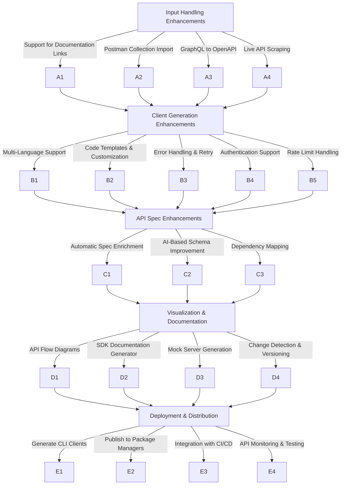

# API Automation Enhancements Task List

## 1. Input Handling Enhancements

### Support for Documentation Links
- Fetch OpenAPI specs from README, Postman, Swagger UI, or API documentation pages.
- Auto-extract API definitions from HTML pages with embedded OpenAPI JSON/YAML.

### Postman Collection Import
- Convert Postman collections into OpenAPI specs for client generation.

### GraphQL to OpenAPI Conversion
- Convert GraphQL schemas into OpenAPI specs to generate clients.

### Live API Scraping
- Use an API interceptor to capture network requests from an app and generate OpenAPI specs.

## 2. Client Generation Enhancements

### Multi-Language Client Generation
- Expand supported languages (Python, TypeScript, Go, Java, Swift, Kotlin, etc.).
- Generate idiomatic SDKs tailored for each language.

### Code Templates & Customization
- Allow users to specify templates or customize SDK structures (e.g., using different HTTP clients).

### Error Handling & Retry Strategies
- Auto-generate clients with built-in error handling, retries, and logging.

### Authentication Support
- Detect OAuth, API Key, JWT, or other auth mechanisms and generate clients accordingly.

### Rate Limit Handling
- Auto-generate rate-limit handling logic based on API documentation.

## 3. API Spec Enhancements

### Automatic Spec Enrichment
- Add missing examples, descriptions, and default values based on API responses or historical data.

### AI-Based Schema Improvement
- Use LLMs to improve descriptions, deduplicate endpoints, or suggest missing fields.

### Dependency & Relationship Mapping
- Identify dependencies between APIs and generate flow diagrams.

## 4. Visualization & Documentation

### API Flow Diagrams
- Auto-generate relationship diagrams of endpoints, request flows, and dependencies.

### Client SDK Documentation Generator
- Generate Markdown or HTML docs along with client SDKs.

### Mock Server Generation
- Create a mock server from OpenAPI specs for testing.

### Change Detection & Versioning
- Detect API changes and suggest version upgrades.

## 5. Deployment & Distribution

### Generate CLI Clients
- Create command-line tools for interacting with APIs.

### Publish to Package Managers
- Auto-publish SDKs to npm, PyPI, Maven, etc.

### Integration with CI/CD
- Provide GitHub/GitLab actions to automate SDK generation.

### API Monitoring & Testing
- Generate Postman collections or test cases based on OpenAPI specs.

[](https://mermaid.live/edit#pako:eNptlF9vmzAUxb_KFQ99ajQV0pdMmpTYrENLtK6J-rBkDy7cBitgI2NSZU2_-64NqdmfhygH_OP63OsDr1GuC4xm0U7tjWhK2PCPOwUw32aq6Sx8EaqopNpDqkqhcqxR2fYnTCafzuuuabSx8KwNcJ13bklYqRUspTq0Z5jf-EoevtetrYUCpqsKc09ltXucsDhgd87D9yVYDd8aVPP7jNaTsL6URwS6C-ucSPJFy1O37H6LLaskmYA7VGh6K__aXnWVlZOlUPtO7BGGLs6w8G4XnmE0E9hg3VTCYgtXwLrW6lr-8kWJjQObGkMDeJ_TFTygNSdiksDMO1uSA5n3psKe08A80FY0uVqGoRNwe2mObX3bDeb_6Ynq65pq5xfAyLx062dgvi3WY9lkIVosaHol1sKdgNFHHMA4gBxp-AWq_AQr0fRzZtSPI_j2UbadqIZhUMN_HP5giLx-rvQLcCkoVzWlgXsjvI8O__pXZIYj04bAOIArnR9gjeaIZnSqxCSBYTQNOkiOdgjWFTyiaUl533za-0631FWlT25PZ1q21sinLnge6iOwZQZ9ksh26m2nfYi7p0q2pUvnvcgPLj4roejPODAOYKYs7ocEvkhbAss-ME5MEhg3ohV5pJ773Gywtd5xOjie3zgQFl7HI52M9DToRc8zr-ORTkZ6OtK3QbP-We51PNJJ0LxnUq_jkU5Guq-fRtdRjaYWsqBvy6sPcUTvQI27aEayEOawo2_OG3GCwrs-qTyaWdPhdWR0ty-j2bOoWrrqmoLOZIjR-91GqB9aX67ffgOX_IIv)